# Scheduler Track — Architecture & OS Concept Map (W10/W11)

Owner: 조현성 (스케줄러 담당)
Project: LLM-for-OS intelligent shell (Direction B)
OS target: xv6-riscv

This document captures the **scheduler-side slice** of the team project,
suitable to drop straight into the W11 progress presentation.

---

## 1. Block diagram — scheduler slice

```mermaid
flowchart LR
    user["User<br/>(natural language)"]
    nl["nl_shell.py<br/>(host)"]
    solar["Solar Pro API"]
    spec["spec JSON<br/>{cmd, args, queue_hint, reason}"]
    nlrun["nlrun<br/>(xv6 user prog)"]
    forkpri["forkpri syscall"]
    sched["MLFQ scheduler<br/>kernel/proc.c"]
    trap["timer interrupt<br/>kernel/trap.c"]
    trace["TRACE / EXIT log<br/>(QEMU stdout)"]
    parse["parse_trace.py"]
    viz["viz.py / evaluator.py"]

    user -->|"e.g. 'do X in background'"| nl
    nl -->|prompt| solar
    solar -->|JSON| nl
    nl -.->|"heuristic<br/>fallback"| spec
    solar --> spec
    spec -->|"nlrun &lt;q&gt; &lt;cmd&gt; ..."| nlrun
    nlrun -->|"forkpri(level)"| forkpri
    forkpri --> sched
    trap -->|tick demotion| sched
    sched --> trace
    trace --> parse
    parse --> viz

    classDef host fill:#e3f2fd,stroke:#1976d2;
    classDef kernel fill:#ffe0b2,stroke:#e65100;
    classDef llm fill:#c8e6c9,stroke:#2e7d32;
    class nl,parse,viz host;
    class nlrun,forkpri,sched,trap kernel;
    class solar llm;
```



**Reading the diagram:**
- **Blue** = host Python (no kernel privilege).
- **Orange** = xv6 kernel / user-program code we wrote.
- **Green** = external LLM (Solar Pro).

The kernel never talks to Solar directly. Solar's output is downgraded
to a single integer (`queue_hint`) before it crosses into kernel space
via `forkpri()`. The kernel is free to ignore or override the hint.

---

## 2. Data flow at a glance

```
"Run a heavy job in background"
        │
        ▼  (NL_TO_SPEC_PROMPT)
Solar Pro 2/3
        │
        ▼  (validated JSON)
{cmd:"cpu_burner", args:["1000000"], queue_hint:2, reason:"..."}
        │
        ▼  (host renders as xv6 command line)
$ nlrun 2 cpu_burner 1000000
        │
        ▼  (xv6 user prog parses argv)
forkpri(2)  →  child enters MLFQ queue 2 (LOW)
        │
        ▼  (scheduler picks it, trap.c demotes if slice exceeded)
TRACE tick=… pid=… pri=2 slice=…
EXIT  pid=… name=cpu_burner arrival=… completion=…
```

---

## 3. OS concept mapping (mandatory deliverable)

The course rubric demands "OS concepts as a substantive part of the
implementation." Here is where each concept lives in the **scheduler
slice**:

| OS concept | Implementation | File / function | Notes |
|---|---|---|---|
| **Process creation w/ initial priority** | New `forkpri(level)` syscall — child enters MLFQ queue at chosen level | `kernel/sysproc.c::sys_forkpri` ↔ `user/usys.pl` | Avoids fork→setpri race that I4 patch documented |
| **Multi-Level Feedback Queue (MLFQ)** | 3-level scheduler: HIGH(0) / MID(1) / LOW(2); pick highest non-empty | `kernel/proc.c::scheduler` | Replaces stock xv6 round-robin |
| **Time-slice based demotion** | Each tick increments slice counter; threshold hit → demote one level | `kernel/trap.c` (timer ISR section) | Slices: HIGH=2, MID=4, LOW=8 ticks |
| **Starvation prevention (priority boost)** | Periodic boost of all procs back to HIGH | `kernel/proc.c::scheduler` (boost block) | Protected by `boost_lock` (multi-CPU safe) |
| **I/O-aware queue retention** | `sleep()` (I/O block) resets slice counter but does NOT demote | `kernel/proc.c::sleep` | Keeps I/O-bound procs out of LOW |
| **System call path** | 4 added syscalls follow xv6's standard syscall convention | `syscall.h`/`syscall.c`/`sysproc.c`/`usys.pl`/`user.h` | `setpri`, `getstats`, `settrace`, `forkpri` |
| **Spinlock synchronization** | `boost_lock` guards last_boost_tick across CPUs; per-proc `p->lock` guards priority writes | `kernel/proc.c` | Pattern follows xv6 ptable conventions |
| **Context switch** | Standard xv6 `swtch()` — but `printf` moved out of locked region (C3 fix) | `kernel/proc.c::scheduler` | Avoid holding `p->lock` across I/O |
| **Inter-process priority control** | `setpri(pid, level)` lets one process re-tier another | `kernel/sysproc.c::sys_setpri` | Used by LLM hints applied externally |
| **Kernel-userspace bridge for telemetry** | `getstats` + `TRACE`/`EXIT` printf | `sysproc.c::sys_getstats` + `proc.c` instrumentation | Host parses textual log |

**One-line summary for the slide:** *"Six classical OS concepts — MLFQ
scheduling, time-slice demotion, anti-starvation boost, I/O-aware queue
retention, spinlock synchronization, and the syscall path — implemented
as real xv6 kernel C code."*

---

## 4. Interfaces this slice exposes to the rest of the team

For W13 integration (intentionally minimal so other roles can build
on it without coupling to scheduler internals):

| Surface | Direction | Contract |
|---|---|---|
| `forkpri(level)` | other-roles → us | `level ∈ {0,1,2}`. Returns child pid or -1. Identical to `fork()` semantics otherwise. |
| `setpri(pid, level)` | other-roles → us | Re-tier any process. `level ∈ {0,1,2}`, returns 0/-1. |
| `getstats(pid, *out)` | other-roles → us | Fills `struct procstats` — diagnosis layer can read live priority and counters. |
| `settrace(pid, on)` | other-roles → us | Enables `TRACE` line emission per-pid. `pid=0` means self. |
| `TRACE`/`EXIT` lines on stdout | us → host parsers | Stable text format; consumed by `parse_trace.py`. |

No shared memory, no kernel header changes outside what's already in
`smart-mlfq-xv6-patches/`. Other team members can adopt these surfaces
without touching scheduler internals.

---

## 5. What is *not* in this slice (clarifying scope)

To prevent accidental scope creep on the demo:

- ❌ Natural-language **diagnosis** (`/proc`, `dmesg`, syscall trace
  interpretation). That's the diagnosis layer — different role.
- ❌ Zombie process reclamation policy. Process-track role.
- ❌ Thread scheduling. xv6 has no threads stock; thread-track is its
  own subproject.
- ❌ Memory management, paging.

The W11 demo only proves: NL request → queue hint → MLFQ executes at
that level → TRACE confirms.

---

## 6. Status (as of W11 progress checkpoint)

| Item | Status |
|---|---|
| MLFQ scheduler in xv6 kernel | ✅ implemented and patched |
| 4 syscalls (`forkpri`/`setpri`/`getstats`/`settrace`) | ✅ implemented |
| Baseline vs LLM-guided trace experiment | ✅ ran (`baseline.json`, `llm.json`, charts/) |
| NL → spec prompt (`NL_TO_SPEC_PROMPT`) | ✅ added to `prompts.py` |
| Host REPL `nl_shell.py` | ✅ implemented, tested (heuristic + Solar path) |
| xv6 user prog `nlrun.c` | ✅ written, build wired into Makefile (via `apply_patches.sh`) |
| W11 demo runbook | ✅ `DEMO_W11.md` |
| Live end-to-end recording | ⏳ pending (record in WSL) |
| Team integration | ⏳ deferred to W13 (per current plan) |
